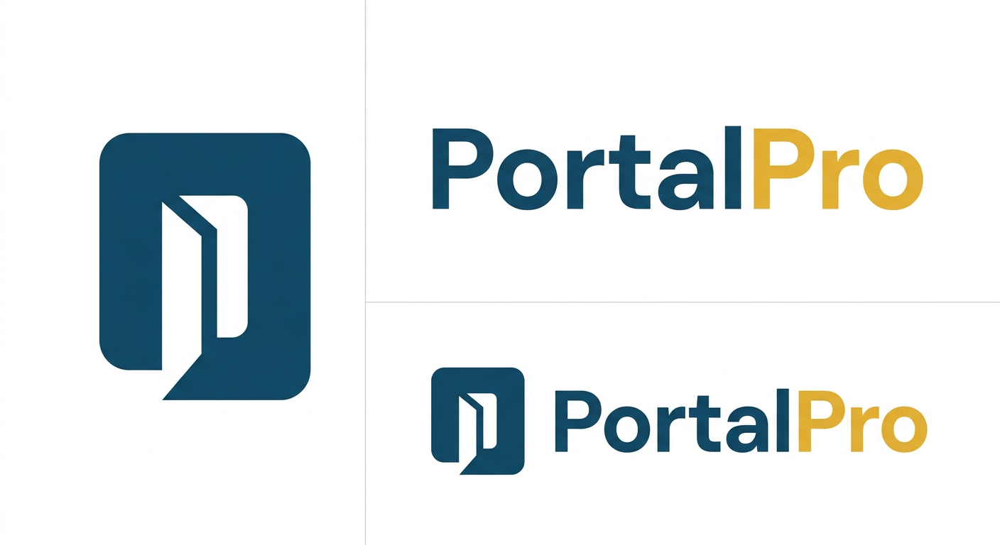

<p align="center">
  
</p>

<p align="center">
  <strong>White-Label Client Portal Builder for Agencies & Consultants</strong>
</p>

<p align="center">
  
  
  
  
  
  
</p>

---

## Live Demo

| App | URL | Credentials |
|-----|-----|-------------|
| **Agency Dashboard** | [portalpro-agency.vercel.app](https://portalpro-agency.vercel.app) | `alice@horizon.agency` / `demo1234` |
| **Client Portal** | [portalpro-portal.vercel.app](https://portalpro-portal.vercel.app/horizon/techvision) | `dana@techvision.co` / `demo1234` |

> The demo uses a shared Supabase database — data resets nightly.

---

## What is PortalPro?

Agencies juggle emails, Drive links, Notion docs, and separate invoicing tools. Clients have no single place to check project status. PortalPro solves this by providing **one branded hub per client** with:

- **Project & Task Management** — Kanban boards, milestones, dependencies, time tracking
- **File Sharing** — Upload to Cloudflare R2, version history, folder navigation
- **Real-time Messaging** — Threaded conversations with Socket.io and email notifications
- **Deliverable Approvals** — Multi-stage review workflows with full revision history
- **Invoicing & Payments** — Multi-currency invoices, Stripe payment links, PDF export
- **White-Label Branding** — Custom logo, colors, and domain per client portal
- **International-First** — GBP/EUR/USD/AED, WCAG AA accessibility, GDPR-ready

---

## Tech Stack

| Layer | Technology |
|-------|-----------|
| **Monorepo** | Turborepo + pnpm workspaces |
| **Frontend** | Next.js 14 (App Router), React 18, Tailwind CSS, shadcn/ui |
| **Backend** | Node.js + Express.js (layered: Route → Controller → Service) |
| **Database** | PostgreSQL (Supabase), Prisma ORM with tenant middleware |
| **Auth** | NextAuth.js v5 — credentials + magic link |
| **File Storage** | Cloudflare R2 (S3-compatible, presigned URLs) |
| **Email** | Nodemailer via Gmail SMTP + React Email templates |
| **Payments** | Stripe Payment Links + webhook handler |
| **Real-time** | Socket.io (project-scoped rooms) |
| **Rate Limiting** | Upstash Redis |
| **CI/CD** | GitHub Actions (typecheck → lint → build) |
| **Deployment** | Vercel (agency + portal) + Railway (API) |

---

## Architecture

```
portalpro/                    ← Turborepo monorepo root (git root)
├── apps/
│   ├── agency/               ← Agency Dashboard  (Next.js, port 3000)
│   ├── portal/               ← Client Portal     (Next.js, port 3001)
│   └── api/                  ← REST API + Socket  (Express, port 4000)
│
├── packages/
│   ├── database/             ← Prisma schema, singleton client, tenant middleware
│   ├── ui/                   ← Shared component library (shadcn/ui based)
│   ├── types/                ← TypeScript interfaces, Zod schemas, error classes
│   ├── utils/                ← Pure utilities (currency, dates, slugify)
│   ├── email/                ← React Email templates + Nodemailer mailer
│   ├── auth/                 ← NextAuth config, RBAC role hierarchy
│   └── config/               ← Shared Tailwind preset with design tokens
│
└── tooling/
    ├── eslint/               ← Shared ESLint config
    ├── typescript/           ← Shared tsconfig presets
    └── prettier/             ← Shared Prettier config
```

**Multi-tenancy**: Shared database with application-level row isolation via Prisma middleware. Every tenant-scoped query is automatically filtered by `tenantId` — no cross-tenant data leakage is possible.

---

## Key Engineering Decisions

| Decision | Rationale |
|----------|-----------|
| **Shared DB multi-tenancy** | Simpler ops than per-tenant DBs; Prisma middleware enforces isolation |
| **Express over tRPC** | Explicit REST API is easier to demonstrate and document for portfolio |
| **NextAuth JWE tokens** | API decrypts NextAuth session tokens using HKDF — no separate auth service |
| **Cloudflare R2** | S3-compatible, 10GB free tier, no egress fees |
| **Nodemailer + Gmail** | Zero external service dependency for email in development |
| **Socket.io project rooms** | Lightweight real-time without a managed WS service |

---

## Prerequisites

| Tool | Version | Install |
|------|---------|---------|
| **Node.js** | ≥ 20 LTS | [nodejs.org](https://nodejs.org) |
| **pnpm** | ≥ 10 | `npm install -g pnpm` |
| **Docker** | Latest | [docker.com](https://docker.com) (for local DB) |

---

## Local Development

### 1. Clone and install

```bash
git clone https://github.com/your-username/portalpro.git
cd portalpro
pnpm install
```

### 2. Environment variables

```bash
cp .env.example .env.local
```

Fill in `.env.local`. For local development, only `AUTH_SECRET` and `DATABASE_URL` are required:

```bash
# Generate a secure AUTH_SECRET
openssl rand -base64 32
```

### 3. Start the database

```bash
docker compose -f infra/docker/docker-compose.yml up -d
```

### 4. Set up schema and seed demo data

```bash
pnpm db:push    # push schema to DB
pnpm db:seed    # seed with demo data
```

### 5. Start all apps

```bash
pnpm dev
```

| App | URL |
|-----|-----|
| Agency Dashboard | http://localhost:3000 |
| Client Portal | http://localhost:3001/horizon/techvision |
| API Server | http://localhost:4000 |

### Demo Credentials

| User | Email | Password | Role |
|------|-------|----------|------|
| Alice Chen | `alice@horizon.agency` | `demo1234` | Agency Owner |
| Bob Martinez | `bob@horizon.agency` | `demo1234` | Agency Editor |
| Carol Osei | `carol@sparkcreative.io` | `demo1234` | Agency Owner (Spark) |
| Dana Whitfield | `dana@techvision.co` | `demo1234` | Portal Admin |
| Maya Patel | `maya@techvision.co` | `demo1234` | Portal Viewer |

---

## Available Scripts

| Command | Description |
|---------|-------------|
| `pnpm dev` | Start all apps concurrently |
| `pnpm build` | Production build for all apps and packages |
| `pnpm typecheck` | TypeScript strict-mode check across entire monorepo |
| `pnpm lint` | ESLint across the entire monorepo |
| `pnpm format` | Format all files with Prettier |
| `pnpm db:push` | Push Prisma schema changes to the DB |
| `pnpm db:seed` | Seed demo data (clears existing data first) |
| `pnpm db:studio` | Open Prisma Studio GUI |

---

## Deployment

### Agency + Portal apps → Vercel

1. Connect your GitHub repo to Vercel
2. Create **two** Vercel projects from the same repo
3. For each project, configure in the Vercel dashboard:

**Agency project:**
| Setting | Value |
|---------|-------|
| Root Directory | `portalpro` |
| Build Command | `pnpm build --filter=@portalpro/agency` |
| Install Command | `pnpm install --frozen-lockfile` |
| Output Directory | `apps/agency/.next` |

**Portal project:**
| Setting | Value |
|---------|-------|
| Root Directory | `portalpro` |
| Build Command | `pnpm build --filter=@portalpro/portal` |
| Install Command | `pnpm install --frozen-lockfile` |
| Output Directory | `apps/portal/.next` |

4. Add all environment variables from `.env.example` in each project's Vercel settings

### API server → Railway

The Express + Socket.io API cannot run on Vercel (requires persistent connections). Use Railway:

1. Create a new Railway project → "Deploy from GitHub repo"
2. Set **Root Directory** to `portalpro`
3. Railway auto-detects `apps/api/railway.toml` and uses nixpacks to build
4. Add all environment variables in Railway's dashboard
5. Run database migrations in Railway's shell: `pnpm db:push`

### Environment Variables Checklist

| Variable | Agency | Portal | API |
|----------|--------|--------|-----|
| `DATABASE_URL` | ✓ | ✓ | ✓ |
| `DIRECT_URL` | ✓ | ✓ | ✓ |
| `AUTH_SECRET` | ✓ | ✓ | ✓ |
| `AUTH_URL` | ✓ | — | — |
| `NEXT_PUBLIC_API_URL` | ✓ | ✓ | — |
| `NEXT_PUBLIC_AGENCY_URL` | ✓ | ✓ | — |
| `NEXT_PUBLIC_PORTAL_URL` | ✓ | ✓ | — |
| `R2_ACCOUNT_ID` | ✓ | ✓ | ✓ |
| `R2_ACCESS_KEY_ID` | ✓ | ✓ | ✓ |
| `R2_SECRET_ACCESS_KEY` | ✓ | ✓ | ✓ |
| `R2_BUCKET_NAME` | ✓ | ✓ | ✓ |
| `SMTP_HOST` | — | — | ✓ |
| `SMTP_USER` | — | — | ✓ |
| `SMTP_PASS` | — | — | ✓ |
| `STRIPE_SECRET_KEY` | — | — | ✓ |
| `STRIPE_WEBHOOK_SECRET` | — | — | ✓ |
| `NEXT_PUBLIC_STRIPE_PUBLISHABLE_KEY` | ✓ | ✓ | — |
| `UPSTASH_REDIS_REST_URL` | — | — | ✓ |
| `UPSTASH_REDIS_REST_TOKEN` | — | — | ✓ |

---

## Third-Party Services

All services have generous free tiers — total monthly cost for a portfolio deployment is **$0–$5**.

| Service | Purpose | Free Tier |
|---------|---------|-----------|
| [Supabase](https://supabase.com) | PostgreSQL | 500 MB, 2 connections |
| [Cloudflare R2](https://dash.cloudflare.com) | File storage | 10 GB, no egress fees |
| [Stripe](https://stripe.com) | Payments | Pay-per-use (2.9% + 30¢) |
| [Upstash](https://upstash.com) | Redis rate limiting | 10K commands/day |
| [Railway](https://railway.app) | API hosting | $5/month credit |
| [Vercel](https://vercel.com) | Next.js hosting | Hobby tier free |

---

## Design System

| Role | Color | Hex |
|------|-------|-----|
| Primary | Deep Teal | `#1B4D6E` |
| Primary Light | Ocean Blue | `#2E86AB` |
| Primary Dark | Midnight | `#0F3049` |
| Accent | Warm Gold | `#E8B931` |
| Success | Green | `#16A34A` |
| Warning | Yellow | `#EAB308` |
| Error | Red | `#DC2626` |

**Typography**: Inter (Latin), with JetBrains Mono for code.

---

## License

MIT
